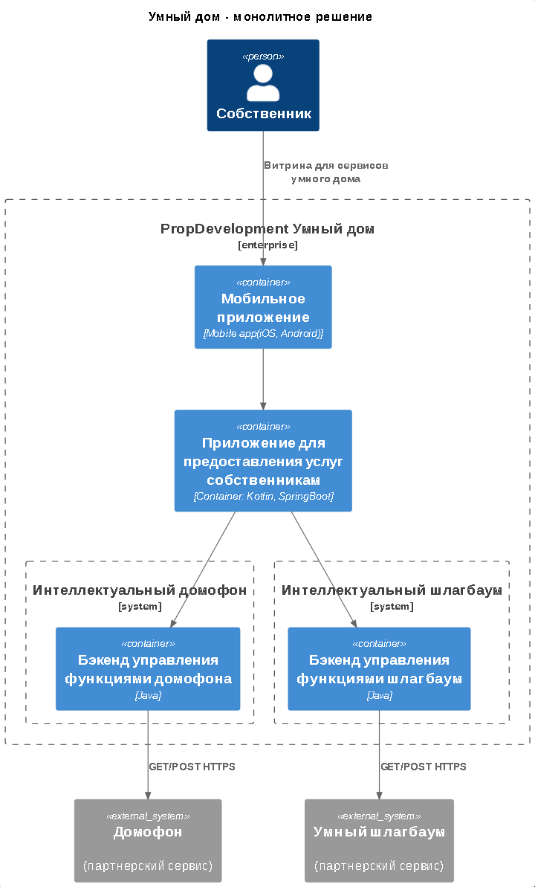

# Задание 3. Внешние интеграции

1. Подготовьте диаграмму контекста в модели С4: [Диаграмма контекста](./task3_c4_context.puml)
2. Доработайте диаграмму контейнеров PropDevelopment: [Диаграмма контейнеров](./PropDevelopment_С4_model.drawio.xml)
3. Сформируйте список требований, которым должны удовлетворить внешние интеграции. (решение описано далее по тексту)

## Требования к внешним интеграциям

1. Хорошая API-документация
2. Высокая скорость отклика и стабильная работа на нагрузках
3. Круглосуточная техническая поддержка и SLA
4. Время безотказной работы 99.9%, время простоя не более 9 часов 45 минут в год
5. Логирование операций и доступа и доступ  к данным логов по запросу, логи должны храниться не менее 3 месяцев

### Требования к безопасности

1. Шифрование данных при передаче (TLS 1.2/1.3)
2. Шифрование данных при хранении
3. Механизмы защиты от DDoS-атак, ограничение частоты запросов
4. Использование сертифицированных СКЗИ
5. Защита персональных данных (в идеале отсутствие персональных данных в работе с API)
6. Соблюдение требований 149-ФЗ и Мин.Цифры
7. Документация по инцидентам

### Протоколы аутентификации и авторизации

1. Поддержка современных протоколов ( OAuth 2.0, OpenID Connect (использование JWT))
2. TLS 1.2/1.3 для всех передаваемых данных

(в идеале мы не должны использовать 1 учетную запись для внешнего сервиса, 1 пользователь - 1 запись)

## Отдельно, диаграмма контекста

